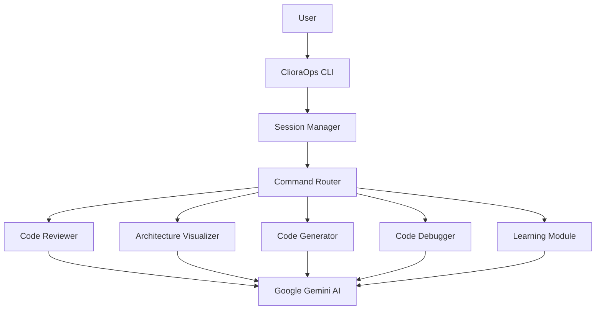

# ClioraOps Architecture

## System Overview

ClioraOps is designed as a modular, improved CLI tool powered by Google Gemini AI. It enhances raw AI capabilities with safety rails, educational modes, and structured DevOps workflows.

### Core Philosophy
1.  **Safety First**: No command should be executed blindly. Destructive commands are intercepted.
2.  **Context Aware**: The system adapts to the user's expertise level (Beginner vs Architect).
3.  **Educational**: Every interaction is an opportunity to learn, not just execute.

## High-Level Design

## Module Breakdown

### 1. Core (`clioraOps_cli.core`)
The backbone of the application.

-   **`app.py`**: Entry point. Initializes the application state and components.
-   **`session.py`**: Manages the interactive session loop, ensuring state persistence across commands.
-   **`commands.py`**: Routes parsed commands to handlers. Integrated with `PolicyManager` for access control.
-   **`init_manager.py` (v0.3.0)**: Handles project-specific agent instructions and initial secret scans.
-   **`policy.py`**: Manages filesystem access policies for AI operations.
-   **`modes.py`**: Defines `Mode` (`BEGINNER`, `ARCHITECT`).

### 2. Features (`clioraOps_cli.features`)
Specific capabilities exposure to the user.

-   **`reviewer.py`**: 
    -   Implements regex-based pattern matching for dangerous commands.
    -   Detects hardcoded secrets and uninitialized variable usage (`rm -rf $VAR`).
-   **`visualizer.py`**: 
    -   Orchestrates diagram generation using specialized modules:
        -   **`models.py`**: Shared diagram data models.
        -   **`ascii_gen.py`**: Predefined ASCII templates.
    -   Supports AI-aided custom diagrams and Mermaid syntax.
-   **`code_generator.py`**: 
    -   Uses templates and AI to scaffold project files.
    -   Ensures generated code follows best practices for the active mode.
-   **`code_debugger.py`**: 
    -   Parses error messages and uses AI to determine root causes.
    -   Provides step-by-step verification instructions.

### 3. Integrations (`clioraOps_cli.integrations`)
External system interfaces.

-   **`ai_provider.py`**:
    -   Centralizes AI logic for Google Gemini, OpenAI, Anthropic, Ollama, and local fallbacks.
    -   Standardizes prompts and responses across different providers.
    -   Handles API authentication and error reporting for all supported platforms.

## Data Flow

### Command Execution Flow
1.  **Input**: User types `try rm -rf /`.
2.  **Routing**: `CommandRouter` identifies the `try` command.
3.  **Processing**: `CodeReviewer` analyzes the argument.
4.  **Logic**: 
    -   Regex matches `DANGEROUS_PATTERN`.
    -   `RiskLevel` is determined as `CRITICAL`.
5.  **Output**: System blocks execution and displays a warning with an educational note.

### AI interaction Flow
1.  **Input**: User types `explain kubernetes pods`.
2.  **Context**: System checks mode (e.g., `Beginner`).
3.  **Prompt Engineering**: `AIClient` constructs a rich prompt with the active mode's persona and session context.
4.  **Execution**: Calls Google Gemini AI API via `GeminiProvider`.
5.  **Output**: Returns and formats the AI response.

## Future Extensibility
-   **Plugin System**: Allow community features to be added to `features/`.
-   **State Persistence**: Save session history to a local database.
-   **Web UI**: Optional local web dashboard for complex visualizations.
